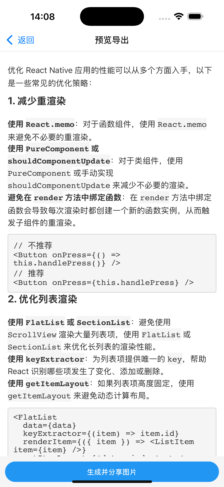
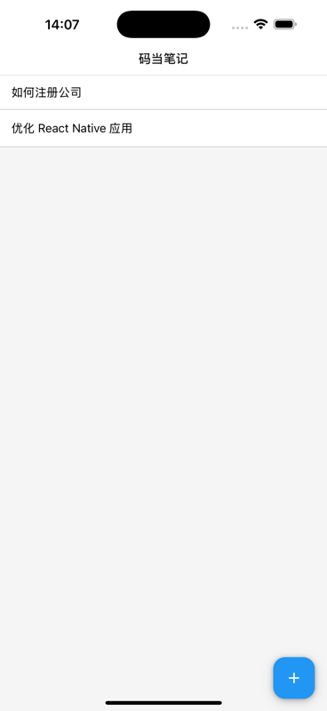
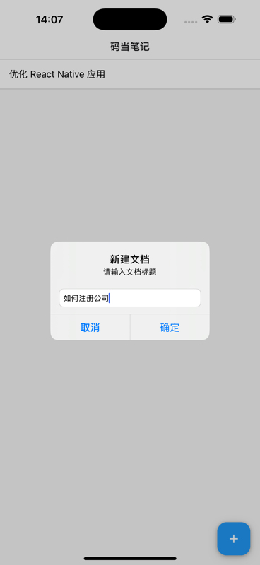

# MDCanvas

[English](README.md) | [中文](README.zh.md)

<p align="center">
  
</p>

MDCanvas is a powerful Markdown to Image converter for iOS. Convert your Markdown notes into beautiful, shareable images with just a few taps.

<p align="center">
  <a href="https://apps.apple.com/cn/app/%E7%A0%81%E5%BD%93%E7%AC%94%E8%AE%B0-markdown%E7%A5%9E%E5%99%A8/id6741430391">
    
  </a>
</p>

## 📱 Screenshots

<p align="center">
  
  
  
</p>

## ✨ Features

- 📝 Clean and intuitive Markdown editor
- 👀 Real-time preview with beautiful formatting
- 🖼 Export notes as high-quality images
- 🎨 Support for custom styling and themes
- 📱 Full iPad optimization with split-screen support

## 🚀 Getting Started

### Prerequisites

- Node.js >= 14
- Xcode >= 14
- CocoaPods
- Ruby >= 2.7

### Installation

1. Clone the repository:
```bash
git clone https://github.com/yourusername/MDCanvas.git
cd MDCanvas
```

2. Install JavaScript dependencies:
```bash
yarn install
# OR
npm install
```

3. Install iOS dependencies:
```bash
cd ios
bundle install
bundle exec pod install
cd ..
```

### Running the App

1. Start the Metro bundler:
```bash
yarn start
# OR
npm start
```

2. Run the iOS app:
```bash
yarn ios
# OR
npm run ios
```

## 🔧 Development

### File Structure

This is a new [**React Native**](https://reactnative.dev) project, bootstrapped using [`@react-native-community/cli`](https://github.com/react-native-community/cli).

# Getting Started

> **Note**: Make sure you have completed the [Set Up Your Environment](https://reactnative.dev/docs/set-up-your-environment) guide before proceeding.

## Step 1: Start Metro

First, you will need to run **Metro**, the JavaScript build tool for React Native.

To start the Metro dev server, run the following command from the root of your React Native project:

```sh
# Using npm
npm start

# OR using Yarn
yarn start
```

## Step 2: Build and run your app

With Metro running, open a new terminal window/pane from the root of your React Native project, and use one of the following commands to build and run your Android or iOS app:

### Android

```sh
# Using npm
npm run android

# OR using Yarn
yarn android
```

### iOS

For iOS, remember to install CocoaPods dependencies (this only needs to be run on first clone or after updating native deps).

The first time you create a new project, run the Ruby bundler to install CocoaPods itself:

```sh
bundle install
```

Then, and every time you update your native dependencies, run:

```sh
bundle exec pod install
```

For more information, please visit [CocoaPods Getting Started guide](https://guides.cocoapods.org/using/getting-started.html).

```sh
# Using npm
npm run ios

# OR using Yarn
yarn ios
```

If everything is set up correctly, you should see your new app running in the Android Emulator, iOS Simulator, or your connected device.

This is one way to run your app — you can also build it directly from Android Studio or Xcode.

## Step 3: Modify your app

Now that you have successfully run the app, let's make changes!

Open `App.tsx` in your text editor of choice and make some changes. When you save, your app will automatically update and reflect these changes — this is powered by [Fast Refresh](https://reactnative.dev/docs/fast-refresh).

When you want to forcefully reload, for example to reset the state of your app, you can perform a full reload:

- **Android**: Press the <kbd>R</kbd> key twice or select **"Reload"** from the **Dev Menu**, accessed via <kbd>Ctrl</kbd> + <kbd>M</kbd> (Windows/Linux) or <kbd>Cmd ⌘</kbd> + <kbd>M</kbd> (macOS).
- **iOS**: Press <kbd>R</kbd> in iOS Simulator.

## Congratulations! :tada:

You've successfully run and modified your React Native App. :partying_face:

### Now what?

- If you want to add this new React Native code to an existing application, check out the [Integration guide](https://reactnative.dev/docs/integration-with-existing-apps).
- If you're curious to learn more about React Native, check out the [docs](https://reactnative.dev/docs/getting-started).

# Troubleshooting

If you're having issues getting the above steps to work, see the [Troubleshooting](https://reactnative.dev/docs/troubleshooting) page.

## 📱 Follow Us

Follow us on Xiaohongshu (rednote) for tips and updates:

<p align="center">
  
</p>


## 💝 Support the Project

If you find MDCanvas helpful, you can support the development by:

<p align="center">
  
</p>

Your support helps maintain and improve MDCanvas. Thank you! 🙏
