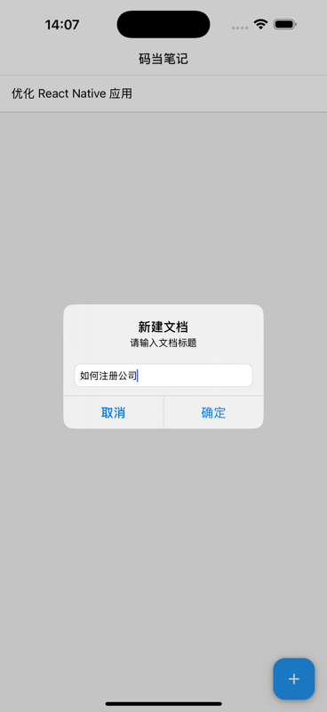
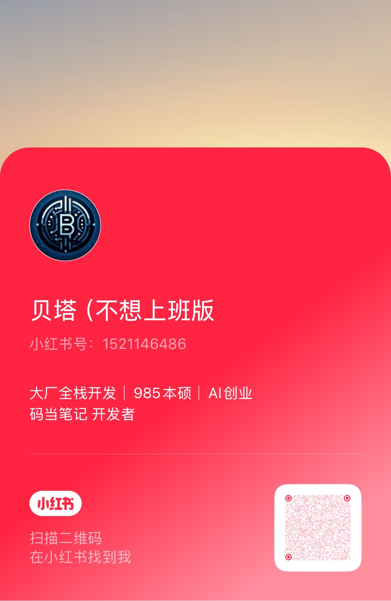

# 码当笔记

[English](README.md) | [中文](README.zh.md)

<p align="center">
  
</p>

码当笔记 是一款强大的 iOS Markdown 转图片工具。只需几步操作，即可将您的 Markdown 笔记转换成精美的可分享图片。

<p align="center">
  <a href="https://apps.apple.com/cn/app/%E7%A0%81%E5%BD%93%E7%AC%94%E8%AE%B0-markdown%E7%A5%9E%E5%99%A8/id6741430391">
    
  </a>
</p>

## 📱 应用截图

<p align="center">
  
  
  
</p>

## ✨ 主要功能

- 📝 简洁直观的 Markdown 编辑器
- 👀 实时预览，精美排版
- 🖼 导出高质量图片
- 🎨 支持自定义样式和主题
- �� iPad 全面优化，支持分屏操作


## 🔧 开发指南

### 文件结构

这是一个使用 [`@react-native-community/cli`](https://github.com/react-native-community/cli) 引导的新 [**React Native**](https://reactnative.dev) 项目。

# 开始使用

> **注意**: 在继续之前，请确保您已完成 [环境搭建](https://reactnative.dev/docs/set-up-your-environment) 指南。

## 步骤 1: 启动 Metro

首先，您需要运行 **Metro**，这是 React Native 的 JavaScript 构建工具。

在 React Native 项目根目录下运行以下命令来启动 Metro 开发服务器：

```sh
# 使用 npm
npm start

# 或使用 Yarn
yarn start
```

## 步骤 2: 构建并运行应用

在 Metro 运行的情况下，从 React Native 项目根目录打开一个新的终端窗口/面板，使用以下命令之一来构建和运行您的 iOS 应用：

### iOS

对于 iOS，请记住安装 CocoaPods 依赖（这只需要在首次克隆或更新原生依赖后运行）。

首次创建新项目时，运行 Ruby bundler 来安装 CocoaPods：

```sh
bundle install
```

然后，每次更新原生依赖时，运行：

```sh
bundle exec pod install
```

更多信息，请访问 [CocoaPods 入门指南](https://guides.cocoapods.org/using/getting-started.html)。

```sh
# 使用 npm
npm run ios

# 或使用 Yarn
yarn ios
```

如果一切设置正确，您应该能在 iOS 模拟器或已连接的设备上看到新应用运行。

这是运行应用的一种方式 — 您也可以直接从 Xcode 构建。

## 步骤 3: 修改应用

现在您已经成功运行了应用，让我们开始修改！

在您选择的文本编辑器中打开 `App.tsx` 并进行一些更改。当您保存时，应用会自动更新并反映这些更改 — 这得益于 [Fast Refresh](https://reactnative.dev/docs/fast-refresh) 功能。

当您想要强制重新加载时（例如重置应用状态），可以执行完全重载：

- **iOS**: 在 iOS 模拟器中按 <kbd>R</kbd> 键

## 恭喜！

您已成功运行并修改了您的 React Native 应用。

### 下一步？

- 如果您想将这个新的 React Native 代码添加到现有应用中，请查看 [集成指南](https://reactnative.dev/docs/integration-with-existing-apps)。
- 如果您想了解更多关于 React Native 的信息，请查看 [文档](https://reactnative.dev/docs/getting-started)。

# 故障排除

如果您在执行上述步骤时遇到问题，请参阅 [故障排除](https://reactnative.dev/docs/troubleshooting) 页面。

## 📱 关注我们

欢迎关注我的小红书账号，获取更多使用技巧和更新动态：

<p align="center">
  
</p>


## 💝 支持项目

如果您觉得 码当笔记 对您有帮助，可以通过以下方式支持项目发展：

<p align="center">
  
</p>

您的支持将帮助我们持续改进 码当笔记，感谢您的信任！ 🙏 
